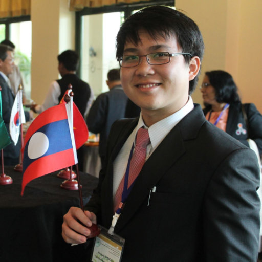

```{r, out.width='25%', fig.align='center', echo=FALSE}

```
<style>
img {
  border-radius: 50%;
}
</style>


<div align="center">
Sébastien M.R. DENTE (PhD) | Senior Researcher </br>
A: College of Science and Engineering, [Ritsumeikan University](http://ritsumei.ac.jp) </br>
<a href="CV.pdf#" class="download" title="Download CV as PDF">Download CV</a>	
</div>

	

# **Education**

+ **Ph.D in Sustainable Development** from Graduate School of Engineering/The University of Troyes, Troyes, France and Faculty of technology, policy and management (TPM)/ TU delft  09/2009 – 09/2013 

+ **M.Sc in Industrial Ecology** from Norwegian University of Science and Technology, Trondheim, Norway and Ecole Centrale de Nantes, Nantes, France  09/2006 - 06/2008
+ **B.Eng in Engineering** from Ecole centrale de Nantes   09/2004 – 06/2006
+ **Preparatory school** from Lycée Louis le Grand, Paris, France.09/2001-06/2004

# **Employment**

- 06/2017 ~ Now | Senior Researcher, Ritsumeikan University, Shiga, Japan
- 06/2015 - 06/2017 | Assistant Researcher, Ritsumeikan University, Shiga, Japan
- 12/2013 - 12/2014 | JSPS Researcher, Ritsumeikan University,Shiga, Japan
- 09/2009 - 09/2012 | Phd candidate and Environmental analyst at itnovem

# **Teaching**
- 06/2017 ~ Now | Introducion class on material flow analyis at Ritsumeikan University, Shiga, Japan.
- 12/2014 - 06/2017 | French teacher at Decouverte, Hyogo, Japan.
- 01/2008-06/2008  Student assistant of class TEP4220 Energy and Environmental Consequences at NTNU, Norway. (http://www.ivt.ntnu.no/ept/fag/tep4220/innhold/TEP4220_08_syllabus.pdf)

# __Publications__ 
#### Journal Articles
#### **2020**

+ __**S.M.R. Dente**__, C. Kayo, C. Aoki-Suzuki, D. Tanaka, and S. Hashimoto: Life cycle environmental impact assessment of biomass materials in Japan, **Journal of Cleaner Production**, Vol.257,12038875 (2020.6) (in English)  (https://www.sciencedirect.com/science/article/pii/S0959652620304352?via%3Dihub) #[Download <i class="fas #fa-file-pdf"></i>](./pdf/20180209_private_#sharing_Comprehensive MFA for Lao PDR to #Inform Environmental and Sustainability #Policy.pdf)
+ A.N. Azimi,__**S.M.R. Dente**__, and S. Hashimoto: Social life-cycle assessment of household waste management system in Kabul City, **Sustainability** (2020.4) (in English).

#### **2019**

+ C. Kayo, --**S.M.R. Dente**--, C. Aoki-Suzuki, D. Tanaka, and S. Hashimoto: Environmental impact assessment of wood use in Japan through 2050 using Material Flow Analysis and Life Cycle Assessment,**Journal of Industrial Ecology**, Vol.23, No.3, p.635-648 (2019.6) (in English)(https://onlinelibrary.wiley.com/doi/abs/10.1111/jiec.12766) 
+ --**S.M.R Dente**--, C, Aoki-Suzuki, D. Tanaka, S. Murakami and S. Hashimoto: Effects of a new supply chain decomposition framework on the material life cycle greenhouse gas emissions -  the Japanese case, **Resources, Conservation and Recycling**, Vol.143, p.273-281 (2019.4) (in English) (https://www.sciencedirect.com/science/article/abs/pii/S0921344918303604?via%3Dihub)

#### Conference Proceedings 

+ Kamrul Islam, **Xaysackda Vilaysouk**, Shinsuke Murakami: ***Environmental impacts of copper mining in Laos: Application of remote sensing and life cycle assessment***, 第１６回「資源・素材・環境」技術と研究の交流会, Tokyo, **Japan**; 08/2019
+ Kamrul Islam, **Xaysackda Vilaysouk**, Shinsuke Murakami: ***Integrating remote sensing and life cycle assessment to quantify the environmental impacts of mining: The case of Lao PDR***, 10th International Conference on Industrial Ecology, Tsinghua University, Beijing, China; 07/2019
+ **Xaysackda Vilaysouk**, Alessio Miatto, Heinz Schandl, Shinsuke Murakami: ***Material Stock of Developing Nation, Lao PDR***, 10th International Conference on Industrial Ecology, Tsinghua University, Beijing, China; 07/2019
+ Kamrul Islam, **Xaysackda Vilaysouk**, Shinsuke Murakami: ***Exploring the relationship between total in-use stock and satellite nighttime light data: A case study from Lao PDR***, The 66th Conference of the Remote Sensing Society of Japan, Toyko, **Japan**; 07/2019
+ **Xaysackda Vilaysouk**, Kamrul Islam, James West, Heinz Schandl, Shinsuke Murakami: ***Environmental impacts of Open-pit Copper mining in Lao PDR: A Life Cycle Assessment***, the EcoBalance 2018, Tokyo, **Japan**; 10/2018 
+ **Xaysackda Vilaysouk**, Shinsuke Murakami, Heinz Schandl : ***The Industrial Ecology Knowledge to support Sustainable Development Goals in ASEAN: Opportunities and challenges***. The Gordon Research Conference on Industrial Ecology, Les Diablerets, Switzerland; 05/2018
+ **Xaysackda Vilaysouk**, Shinsuke Murakami, Heinz Schandl : ***Assessing a Physical Dimension of Lao Economy through Material Flow Analysis***. The 9th biennial conference of the International Society for Industrial Ecology (ISIE) and the 25th annual conference of the International Symposium on Sustainable Systems and Technology (ISSST), Chicago, USA; 07/2017
+ **Xaysackda Vilaysouk**, Shinsuke Murakami: ***Material flow analysis for sustainable resource use in Lao PDR: the potentials and challenges***. the International Society for Industrial Ecology (ISIE) 12th Socio-Economic Metabolism section conference and 5th Asia-Pacific conference, Nagoya University, Nagoya, **Japan**; 09/2016
+ **Xaysackda Vilaysouk**, Sandhya Babel: ***Co-Benefits of Improved Municipal Solid Waste Management in Luangprabang, Lao PDR***. the International Conference on Solid Waste 2015: Knowledge Transfer for Sustainable Resource Management, Hong Kong Convention and Exhibition Centre, Hong Kong SAR, China; 05/2015, DOI:10.13140/RG.2.1.2162.0565
+ **Xaysackda Vilaysouk**, Sandhya Babel: ***Estimation of Greenhouse Gas Emission from Landfill in Luangprabang, Lao PDR***. the 8th GMSARN International Conference 2013 on “Green Growth in GMS: Energy, Environment and Social Issues, Mandalay, Burma; 12/2013, DOI:10.13140/2.1.3358.8000
+ **Xaysackda Vilaysouk**, Sandhya Babel: ***Comparison of Potential Greenhouse Gas Emission from Municipal Solid Waste Disposal Site in Savannakhet and Champasak, Lao PDR***. The 6th ACEC and The 6th AEEC, Bangkok, Thailand; 11/2013, DOI:10.13140/2.1.5062.7368
